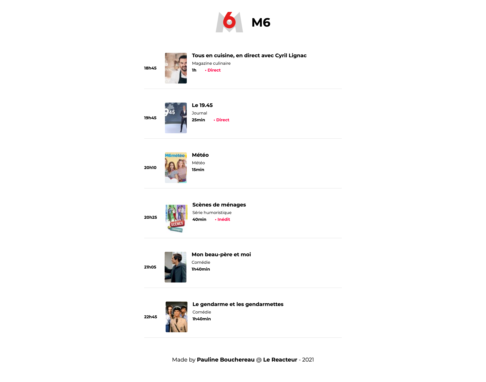

# 📺  TV PROGRAM

**A quiet night in ?** CCheck out what is going on M6, the French TV chanel !

**Frontend project**

👉 Netlify Link to see the live version [HERE](https://tv-program-pb.netlify.app/)



_Made in 2021 @ Le Reacteur_

### ⚙️ Main functionalities :

Create a one-page website using React.JS

### 🔧 Stack

✔️ React.JS  
✔️ Javascript  
✔️ HTML 5  
✔️ CSS 3

### 🚀 Running the project

#### Clone this repository :

```javascript
git clone https://github.com/Pauline-Bouchereau/tv-programm
cd tv-programm
```

#### Install packages :

```javascript
yarn
```

#### When installation is complete :

```javascript
yarn start
```
